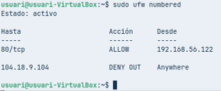

# 📘 Informe Técnico: Configuración del Cortafuegos UFW en Zorin OS

> **Propósito:** Este documento técnico detalla el procedimiento completo para la implementación y gestión del cortafuegos UFW (*Uncomplicated Firewall*) en un sistema Zorin OS, abarcando desde la configuración inicial hasta reglas específicas de filtrado de tráfico.

---

## 🏗️ Requisitos Previos del Entorno

Antes de iniciar la configuración, asegúrese de que su máquina virtual cumpla con los siguientes requisitos:

| Componente | Configuración | Propósito |
|------------|---------------|-----------|
| **Interfaz 1** | NAT | Conectividad a Internet |
| **Interfaz 2** | Host-Only | Comunicación con el equipo anfitrión |
| **Servicio SSH** | Instalado (`openssh-server`) | Acceso remoto seguro |
| **Servicio HTTP** | Instalado (`nginx`) | Servidor web |

### Instalación de Servicios Requeridos

Ejecute los siguientes comandos para instalar los paquetes necesarios:

```bash
sudo apt install ssh -y
sudo apt install nginx -y
```


---

## 🔒 Fase 1: Inicialización y Política Predeterminada

### 1.1 — Consulta del Estado y Reglas Iniciales

> **Criterio:** *Mostrar reglas definidas. Explicar cuáles son las reglas por defecto.*

Ejecute las siguientes instrucciones para conocer el estado actual del cortafuegos:

| Comando | Función |
|---------|---------|
| `sudo ufw status` | Verificar si el servicio está activo o inactivo |
| `sudo ufw enable` | Habilitar el cortafuegos para que comience a filtrar tráfico |
| `sudo ufw status verbose` | Obtener información detallada del estado y reglas configuradas |


**Análisis Técnico:** UFW opera mediante reglas de tipo `allow` (permitir) o `deny` (denegar). Al ejecutar el modo `verbose`, se observa que la política predeterminada establece el bloqueo de todo el tráfico entrante (`deny incoming`) y la aceptación del tráfico saliente (`allow outgoing`). Si existieran reglas previas, deberían eliminarse para mantener únicamente el comportamiento por defecto.


---

### 1.2 — Validación de la Política de Denegación Entrante

> **Criterio:** *Comprobar regla deny por defecto.*

| Comando | Descripción |
|---------|-------------|
| `sudo ufw default deny` | Establecer explícitamente el bloqueo del tráfico entrante |


**Procedimiento de verificación:** Desde el equipo anfitrión, intente establecer una conexión SSH hacia la máquina virtual. La conexión no será posible.

**Fundamento técnico:** Cuando se intenta establecer una conexión TCP por el puerto 22 desde el anfitrión, el cortafuegos intercepta el paquete. Al aplicarse la directiva predeterminada `deny`, la petición se descarta silenciosamente y la conexión resulta fallida.


---

### 1.3 — Aplicación de Política de Denegación Saliente

> **Criterio:** *Aplicar regla deny al tráfico de salida por defecto.*

| Comando | Descripción |
|---------|-------------|
| `sudo ufw default deny outgoing` | Bloquear todo el tráfico de salida del sistema |

**Procedimiento de verificación:** Tras aplicar la regla, ejecute un comando `ping` hacia un servidor externo (por ejemplo, Google).

**Fundamento técnico:** Se modifica la directiva general para denegar el tráfico de salida. Los paquetes ICMP generados por el comando `ping` son descartados internamente por el sistema antes de poder atravesar la interfaz NAT.


---

## 🛡️ Fase 2: Gestión Específica del Tráfico

### 2.1 — Restauración del Tráfico de Salida

> **Criterio:** *Aplicar regla allow al tráfico de salida por defecto.*

| Comando | Descripción |
|---------|-------------|
| `sudo ufw default allow outgoing` | Restablecer la permisividad del tráfico saliente |

**Procedimiento de verificación:** Ejecute nuevamente un `ping` hacia Google para confirmar la restauración de la conectividad.

**Fundamento técnico:** Se restablece la política de salida permitiendo el tráfico. Los paquetes ICMP ahora pueden atravesar el cortafuegos hacia Internet y se recibe la respuesta correspondiente.


---

### 2.2 — Bloqueo de un Destino Específico en Internet

> **Criterio:** *Regla para prohibir acceso a un sitio de Internet.*

**Paso 1 — Resolución de dirección IP:**

```bash
ping -c 1 capgros.elnacional.cat
```

Anote la dirección IP resultante.

**Paso 2 — Aplicación de la regla de bloqueo:**

```bash
sudo ufw deny out to [DIRECCIÓN_IP]
```

**Procedimiento de verificación:** Ejecute un `ping` hacia la IP bloqueada para confirmar la restricción.

**Fundamento técnico:** Las reglas se aplican por orden de prioridad, siendo fundamental definir las reglas específicas antes que las generales para evitar conflictos. Esta regla prohíbe el tráfico cuando el paquete de salida (`out`) tiene como destino exacto la IP especificada. Al ser la regla más específica, tiene preferencia sobre la regla general de permiso.


---

### 2.3 — Habilitación de Acceso a Nginx desde el Anfitrión

> **Criterio:** *Habilitar regla para servidor Nginx desde el anfitrión.*

| Comando | Descripción |
|---------|-------------|
| `sudo ufw allow from 192.168.56.107 to any port 80 proto tcp` | Permitir tráfico HTTP desde la IP del anfitrión |

**Procedimiento de verificación:** Acceda al servidor web Nginx desde el navegador del equipo anfitrión (dirección `192.168.56.107`).

**Fundamento técnico:** UFW permite combinaciones entre direcciones IP y puertos al definir reglas. El cortafuegos únicamente permitirá conexiones entrantes al puerto 80 (protocolo TCP) si provienen exclusivamente de la dirección IP del equipo anfitrión.


---

### 2.4 — Verificación de Restricción por Dirección IP

> **Criterio:** *Modificar regla para servidor Nginx con una IP diferente.*

**Paso 1 — Identificar la regla existente:**

```bash
sudo ufw status numbered
```

**Paso 2 — Eliminar la regla anterior:**

```bash
sudo ufw delete [NÚMERO_DE_REGLA]
```

**Paso 3 — Crear nueva regla con IP ficticia:**

```bash
sudo ufw allow from 192.168.56.222 to any port 80 proto tcp
```


**Procedimiento de verificación:** Intente recargar la página web de Nginx desde el navegador del anfitrión y observe el resultado.

**Fundamento técnico:** Al modificar la regla para una dirección IP diferente, el anfitrión pierde el acceso. Dado que su dirección IP ya no coincide con la excepción configurada, se aplica la política de denegación de tráfico entrante por defecto.


---

### 2.5 — Revisión Final del Conjunto de Reglas

> **Criterio:** *Mostrar reglas creadas.*

| Comando | Descripción |
|---------|-------------|
| `sudo ufw status numbered` | Visualizar todas las reglas con numeración secuencial |

**Fundamento técnico:** Se presenta el conjunto completo de reglas definidas para tráfico entrante, saliente y de enrutamiento. Esta lista funciona como una lista de control de acceso (ACL) final y demuestra visualmente el orden de aplicación de las políticas.



---

> 📋 **Documento técnico** | Configuración UFW en Zorin OS | Cortafuegos y Seguridad de Red
> 
> [← Volver al índice](README.md)
"""

